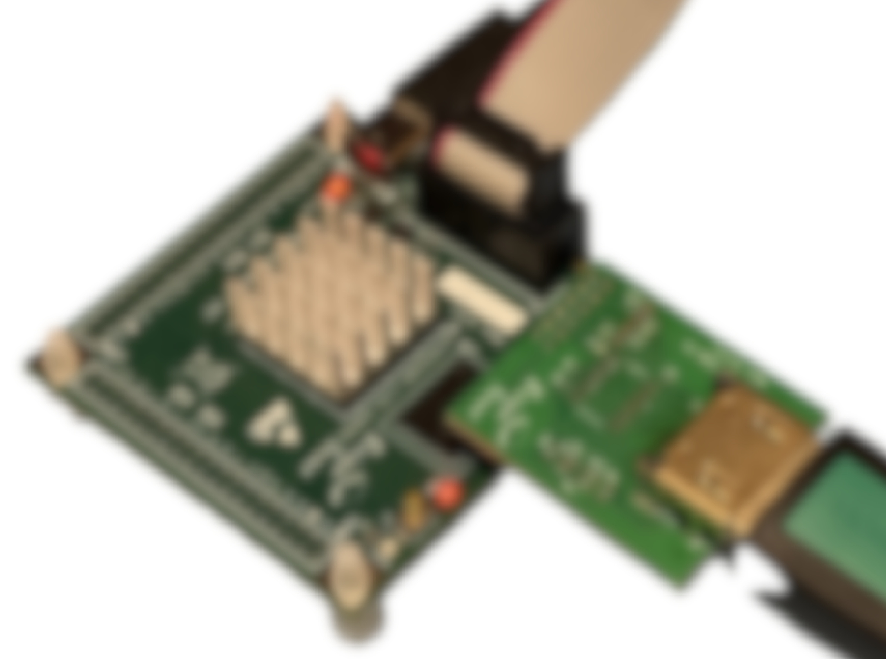
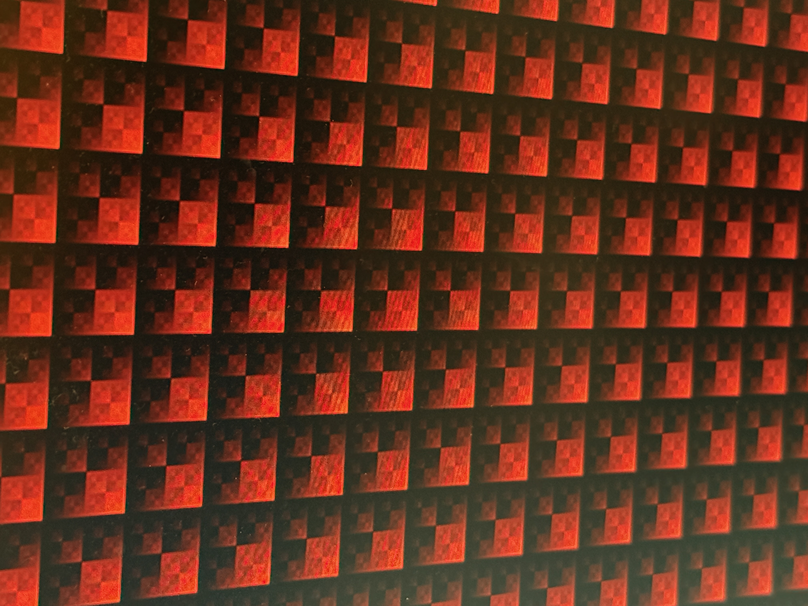
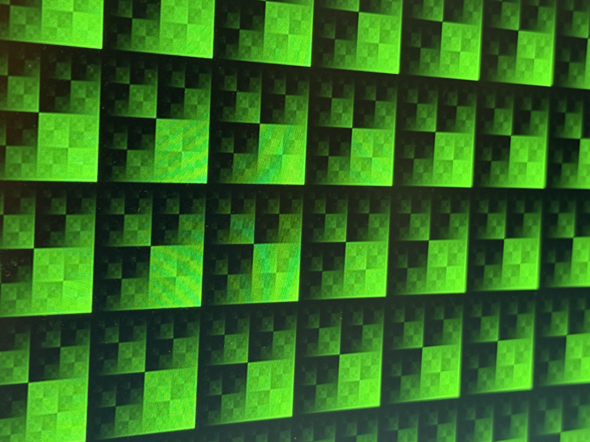
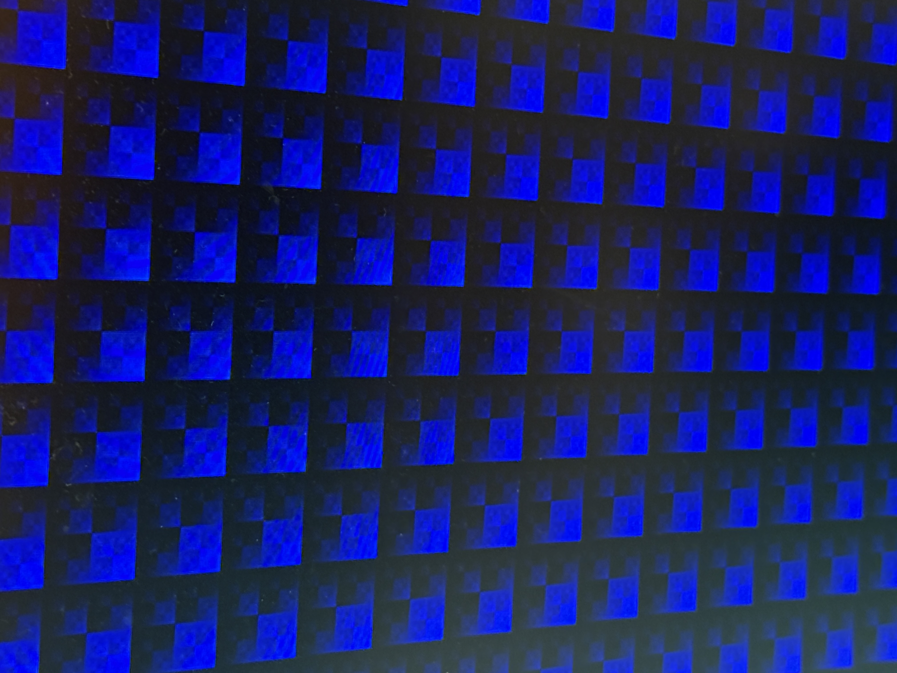

# Modified Briey Example with DDR2 Memory and HDMI Video

## Introduction

Original Briey with VexRISCV project uses scala based general SDRAM controller design and demonstrated a low video resoultion.

With the use of blackbox exporting, shared-AXI4 bus IO can easily migrated with any DDR2 vendor or custom controller.

In this example a custom DDR2 is used, this modified and reconstructed Xilinx ISE old unencrypted Vritex 3/4 DDR design has not use any DQS fabric.

Without DQS fabric many general FPGA with SSTL-1V8 VREF can be applied and real system shows 166MHz on Cyclone 10LP and 133 on Cyclone IV E.

Due to AGM AG16KF256 FPGA routing and placement slacks and hold timing is very unreliable.

Real hardware can only achieve 128MHz and same Pin-to-Pin C4 with 133MHz thermal also shows AGM heats up much more than expected.

## Resource

In the project, scala VexRISCV is shared with related C coding.

User can run it easily via Eclipse IDE

The DDR2 controller and bridge are not shared yet

## Result

### Default SpinalHDL Video Controller

| Test Case | Image |
|-|-|
| R |  |
| G |  |
| B |  |
